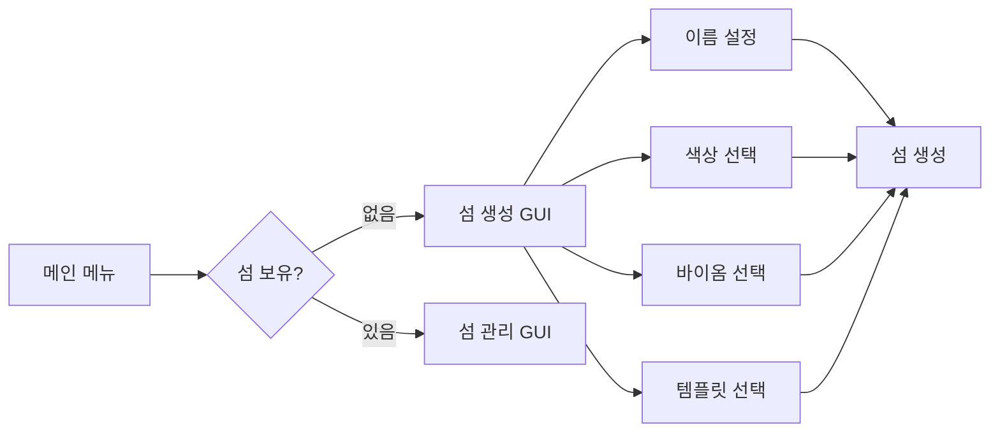
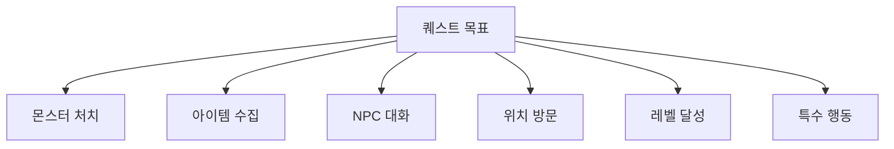
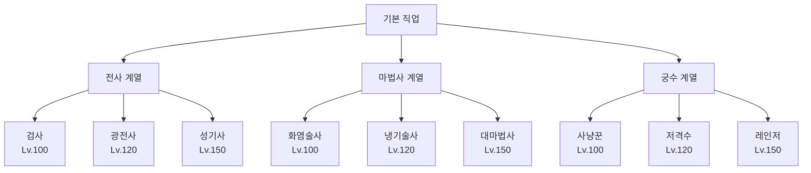
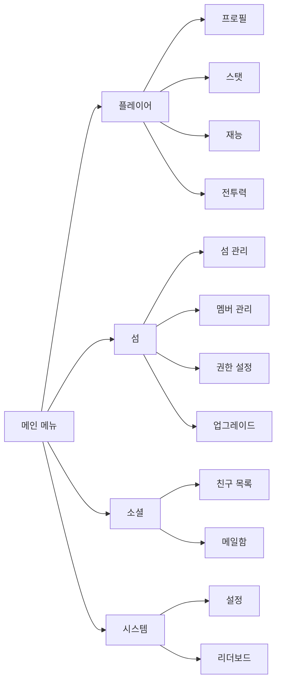

# 🎮 Sypixel RPG - Minecraft RPG Plugin

<div align="center">


*A comprehensive RPG plugin for Minecraft servers with advanced features*

</div>

## 📋 목차

- [🌟 주요 기능](#-주요-기능)
- [🏝️ 섬 시스템](#-섬-시스템)
- [🎯 퀘스트 시스템](#-퀘스트-시스템)
- [💼 직업 시스템](#-직업-시스템)
- [👥 소셜 기능](#-소셜-기능)
- [💰 경제 시스템](#-경제-시스템)
- [🖥️ GUI 시스템](#-gui-시스템)
- [🌐 웹사이트 연동](#-웹사이트-연동)
- [🏗️ 프로젝트 구조](#-프로젝트-구조)
- [⚙️ 설치 및 설정](#-설치-및-설정)
- [📝 명령어](#-명령어)
- [🔧 개발자 가이드](#-개발자-가이드)

## 🌟 주요 기능

### 핵심 시스템
- **🏝️ 섬 시스템** - 개인 섬 생성 및 관리
- **🎯 퀘스트 시스템** - 150개 이상의 퀘스트
- **💼 직업 시스템** - 9개의 고유한 직업
- **👥 소셜 기능** - 친구, 메일, 귓속말
- **💰 경제 시스템** - 6가지 화폐 타입
- **📊 스탯 시스템** - 5가지 기본 능력치
- **🎨 GUI 시스템** - 30개 이상의 인터페이스
- **🌐 웹사이트 연동** - Firebase 인증

## 🏝️ 섬 시스템

### 섬 생성


### 섬 기능
- **🎨 커스터마이징**
  - 섬 이름 (최대 20자)
  - 이름 색상 (8가지 Hex 색상)
  - 바이옴 (8가지 종류)
  - 템플릿 (4가지 기본 템플릿)

- **👥 멤버 관리**
  - 역할: 소유자, 관리자, 멤버, 방문자
  - 권한 시스템
  - 초대 시스템

- **🔧 섬 업그레이드**
  - 크기 확장
  - 워커 시스템
  - 스폰 포인트 관리

### 사용 가능한 바이옴
| 바이옴 | 설명 |
|--------|------|
| 평원 | 기본 초원 환경 |
| 숲 | 나무가 많은 환경 |
| 사막 | 모래 사막 환경 |
| 설원 | 눈 덮인 환경 |
| 정글 | 열대 정글 환경 |
| 늪 | 습지 환경 |
| 사바나 | 건조한 초원 |
| 버섯 들판 | 버섯 바이옴 |

## 🎯 퀘스트 시스템

### 퀘스트 카테고리
- **📚 튜토리얼** - 기본 게임 학습
- **📖 메인** - 스토리 진행 (Chapter 1-10)
- **📝 사이드** - 부가 퀘스트
- **🌅 일일** - 매일 갱신
- **📅 주간** - 매주 갱신
- **⭐ 특별** - 특수 조건
- **🎉 이벤트** - 기간 한정

### 퀘스트 목표 타입


### 주요 퀘스트 (150개+)
- Chapter 1: 영웅의 시작 (10개 퀘스트)
- Chapter 2: 어둠의 그림자 (10개 퀘스트)
- Chapter 3: 고대의 비밀 (10개 퀘스트)
- 그 외 Chapter 4-10

## 💼 직업 시스템

### 직업 트리


### 직업별 특성
| 계열 | 주 스탯 | 보조 스탯 | 특징 |
|------|---------|-----------|------|
| 전사 | 힘 | 체력 | 근접 전투, 높은 방어력 |
| 마법사 | 지능 | 체력 | 마법 공격, 광역 스킬 |
| 궁수 | 민첩 | 힘 | 원거리 공격, 높은 치명타 |

## 👥 소셜 기능

### 친구 시스템
- 친구 요청 발송/수락
- 온라인 상태 확인
- 친구 목록 관리 (최대 100명)
- 친구 정렬 (온라인/오프라인)

### 메일 시스템
- 오프라인 메시지 전송
- 읽음/안읽음 표시
- 메일함 관리
- 자동 만료 (30일)

### 귓속말 시스템
- 1:1 개인 대화
- 차단 기능
- 대화 기록

## 💰 경제 시스템

### 화폐 종류
| 화폐 | 아이콘 | 용도 | 최대 보유량 |
|------|--------|------|-------------|
| 골드 | 🪙 | 기본 화폐 | 1,000,000,000 |
| 다이아몬드 | 💎 | 고급 아이템 | 100,000 |
| 에메랄드 | 💚 | 특수 거래 | 100,000 |
| 가스트 눈물 | 💧 | 희귀 아이템 | 10,000 |
| 네더의 별 | ⭐ | 최고급 아이템 | 1,000 |
| 경험치 | ✨ | 레벨업 | 무제한 |

## 🖥️ GUI 시스템

### GUI 카테고리


### 설정 메뉴
- **GUI 설정** - 인터페이스 옵션
- **인게임 설정** - 게임플레이 옵션
- **알림 설정** - 알림 관리
- **소셜 설정** - 프라이버시
- **시스템 설정** - 성능 옵션

## 🌐 웹사이트 연동

### 계정 연동
```bash
/사이트계정발급 <이메일>
```

### 기능
- Firebase 인증
- 자동 비밀번호 생성 (12자리)
- 관리자 권한 동기화
- 웹사이트 데이터 연동

## 🏗️ 프로젝트 구조

### 리팩토링된 아키텍처

프로젝트는 최근 대규모 리팩토링을 통해 더 깔끔하고 유지보수가 용이한 구조로 개선되었습니다:

- **Quest 시스템**: Builder 패턴을 별도 클래스로 분리, QuestCategory enum 독립
- **Server Stats**: RPGMain에서 ServerStatsManager로 분리하여 단일 책임 원칙 준수
- **코드 정리**: 불필요한 GUI 빌더 제거, 일관된 import 구조
- **안전성 개선**: 타입 안전성 및 예외 처리 강화

```
src/main/java/com/febrie/rpg/
├── 📁 command/              # 명령어 처리
│   ├── admin/              # 관리자 명령어
│   ├── island/             # 섬 명령어
│   ├── social/             # 소셜 명령어
│   └── system/             # 시스템 명령어
├── 📁 database/            # 데이터베이스
│   └── service/            # Firestore 서비스
├── 📁 dto/                 # 데이터 객체
│   ├── island/             # 섬 DTO
│   ├── player/             # 플레이어 DTO
│   ├── quest/              # 퀘스트 DTO
│   └── social/             # 소셜 DTO
├── 📁 economy/             # 경제 시스템
├── 📁 gui/                 # GUI 시스템
│   ├── component/          # GUI 컴포넌트
│   ├── framework/          # GUI 프레임워크
│   └── impl/               # GUI 구현체
├── 📁 island/              # 섬 시스템
│   ├── manager/            # 섬 관리
│   ├── permission/         # 권한 시스템
│   └── world/              # 월드 관리
├── 📁 job/                 # 직업 시스템
├── 📁 level/               # 레벨 시스템
├── 📁 quest/               # 퀘스트 시스템
│   ├── builder/            # [NEW] 퀘스트 빌더
│   │   └── QuestBuilder.java    # Quest.java에서 분리된 빌더 패턴
│   ├── dialog/             # 대화 시스템
│   ├── impl/               # 퀘스트 구현 (150개+)
│   ├── objective/          # 목표 시스템
│   ├── reward/             # 보상 시스템
│   ├── Quest.java          # 퀘스트 기본 클래스
│   ├── QuestCategory.java  # [NEW] 퀘스트 카테고리 enum
│   └── QuestID.java        # 퀘스트 ID enum
├── 📁 social/              # 소셜 기능
├── 📁 stat/                # 스탯 시스템
├── 📁 system/              # [NEW] 시스템 매니저
│   └── ServerStatsManager.java
├── 📁 talent/              # 재능 시스템
│   ├── Talent.java         # 재능 정의
│   └── TalentManager.java  # 재능 관리 및 적용
└── 📁 util/                # 유틸리티
```

## ⚙️ 설치 및 설정

### 요구 사항
- Java 21+
- Paper 1.21.7+
- Firebase 프로젝트
- Maven

### 필수 의존성
- Paper API 1.21.7
- Firebase Admin SDK
- Citizens (NPC)
- WorldGuard (선택)

### Firebase 설정
```bash
# Service Account JSON을 Base64로 인코딩
base64 -w 0 firebase-service-account.json > encoded.txt

# 환경 변수 설정
export FIREBASE_SERVICE_ACCOUNT_BASE64="<encoded.txt 내용>"
export FIREBASE_WEB_API_KEY="<Firebase Web API Key>"
```

### 빌드
```bash
mvn clean package
```

## 📝 명령어

### 플레이어 명령어
| 명령어 | 설명 | 권한 |
|--------|------|------|
| `/메뉴` | 메인 메뉴 열기 | 기본 |
| `/섬` | 섬 관리 | 기본 |
| `/사이트계정발급 <이메일>` | 웹사이트 계정 생성 | sypixelrpg.siteaccount |

### 관리자 명령어
| 명령어 | 설명 | 권한 |
|--------|------|------|
| `/rpgadmin reload` | 플러그인 리로드 | sypixelrpg.admin |
| `/rpgadmin stat <플레이어> <스탯> <값>` | 스탯 설정 | sypixelrpg.admin |
| `/rpgadmin debug` | 디버그 모드 | sypixelrpg.admin |

## 🔧 개발자 가이드

### GUI 생성 예제
```java
public class MyGui extends BaseGui {
    public MyGui(GuiManager manager, LangManager lang, Player player) {
        super(player, manager, lang, 54, "gui.my.title");
        setupLayout();
    }
    
    @Override
    protected void setupLayout() {
        // GUI 레이아웃 구성
        createBorder();
        setupItems();
    }
}
```

### 퀘스트 생성 예제
```java
public class MyQuest extends BaseQuest {
    public MyQuest() {
        super(QuestID.MY_QUEST, QuestCategory.SIDE);
    }
    
    @Override
    protected void setupObjectives() {
        addObjective(new KillMobObjective("zombie", 10));
        addObjective(new TalkToNPCObjective("village_chief"));
    }
}
```

### 이벤트 리스너 예제
```java
@EventHandler
public void onPlayerJoin(PlayerJoinEvent event) {
    Player player = event.getPlayer();
    // 플레이어 데이터 로드
    playerService.loadPlayer(player.getUniqueId());
}
```

## 📊 성능 최적화

- **캐싱**: Caffeine 라이브러리 사용
- **비동기 처리**: CompletableFuture 활용
- **데이터베이스**: Firebase 실시간 동기화
- **청크 로딩**: 최적화된 섬 생성

## 🌍 다국어 지원

현재 지원 언어:
- 🇰🇷 한국어 (기본)
- 🇺🇸 영어

언어 파일 위치: `src/main/resources/lang/`

## 🐛 알려진 이슈 및 개선사항

### 최근 리팩토링 완료 (2025.07.20)
- ✅ Quest.java 리팩토링 - Builder 패턴을 QuestBuilder.java로 분리
- ✅ Quest.java 리팩토링 - Category enum을 QuestCategory.java로 분리
- ✅ RPGMain.java 리팩토링 - 서버 통계 로직을 ServerStatsManager로 분리
- ✅ 모든 Quest 구현체 (46개) Builder 참조 업데이트
- ✅ 모든 Quest 구현체의 QuestCategory import 수정
- ✅ 컴파일 오류 모두 해결

### 개선 필요 사항
- ⏳ BaseFirestoreService.java의 @SuppressWarnings 제거 및 타입 안전성 개선
- ⏳ 하드코딩된 관리자 UUID를 설정 파일로 이동
- ⏳ TalentManager.java (633줄) - 추가 리팩토링 고려

### 미구현 기능
- 일부 소셜 명령어 미등록
- 섬 색상/바이옴 실제 적용 미구현

## 🚀 향후 계획

- [ ] 던전 시스템
- [ ] PvP 아레나
- [ ] 길드 시스템
- [ ] 거래소 시스템
- [ ] 펫 시스템

## 📄 라이선스

이 프로젝트는 비공개 라이선스입니다.

---

<div align="center">

**Developed by Febrie & CoffeeTory**

</div>